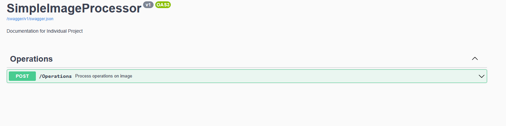
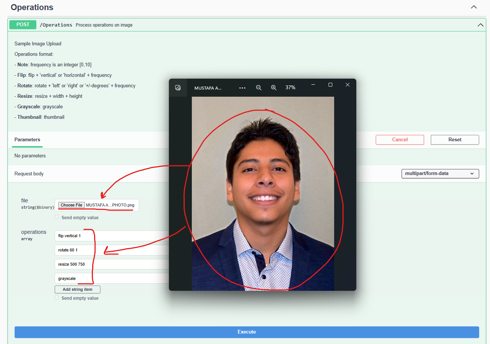
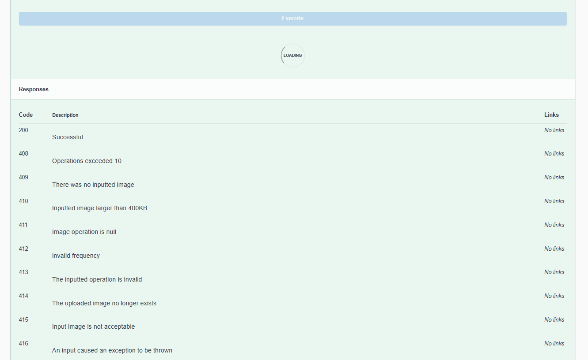
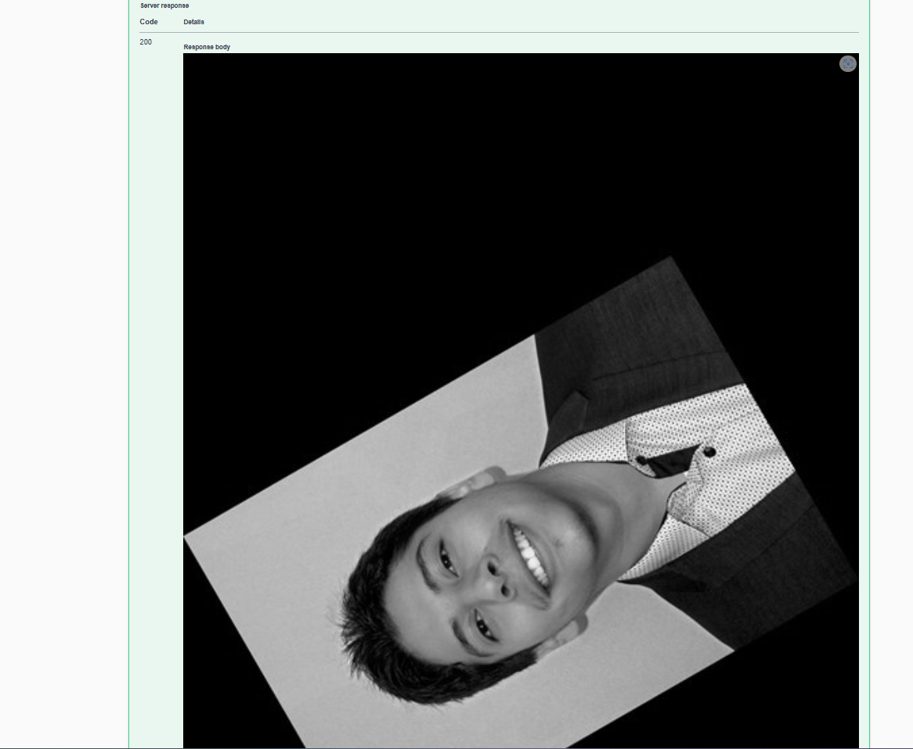

# ImageProcessorAPI

A personal project to practice developing APIs, ImageProcessorAPI provides a platform to perform transformations on uploaded images. The API ensures privacy and security of the images and does not save the images on the server side.

## Features

- Supports Resize, Flip, Rotate, Convert to Grayscale, and Convert to Thumbnail operations on uploaded images
- Client-server & RPC web-service API architecture styles
- Flexible design using a little language and deployable to the cloud
- Security, privacy, and scalability concerns are addressed

## Technologies

ImageProcessorAPI is built using the following technologies:

- ASP.NET
- C#
- Swagger API

## Usage

To use ImageProcessorAPI, upload an image and select the desired transformations to perform. The API will take care of the rest.

## Demo

Here are some images demonstrating the various transformations that ImageProcessorAPI supports:

Upload the image and enter the operations:

        Operations format:
        Note: frequency is an integer [0,10]
        - Flip: flip + 'vertical' or 'horizontal' + frequency
        - Rotate: rotate + 'left' or 'right' or '+/-degrees' + frequency
        - Resize: resize + width + height
        - Grayscale: grayscale
        - Thumbnail: thumbnail

## Note

The API does not save any images on the server side and takes privacy and security concerns into consideration.
